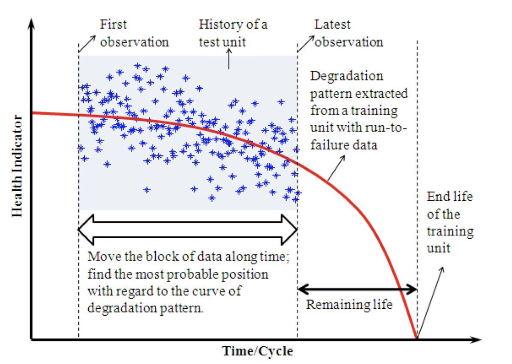

# 
 GA DSI13 Capstone

# 
 Predicting the Useful Remaining Life of Turbofan Engines

## Problem Statement

Prognostics is an engineering discipline focused on predicting the time at which a system or a component will no longer perform its intended function. The predicted time then becomes the remaining useful life (RUL), which is an important concept in decision making for contingency mitigation. Prognostics predicts the future performance of a component by assessing the extent of deviation or degradation of a system from its expected normal operating conditions.

Traditional maintenance concept is typically time/schedule based and is a reactive type of maintenance in the event of premature equipment failure.  On the other hand, condition based maintenance is prognostics-based and a pro-active type of maintenance that relies on early detection and prediction of potential failure of the equipment or component to pre-empt sudden breakdowns and prolonged downtime, resulting in reduced maintenance cost while keeping equipment operationally ready and available.

The aim this project is to build machine learning models capable of forecasting the remaining useful life of turbofan engines (regression model), as well as predicting whether they will fail or not given the operating conditions data (classification model). The output of the models will be computed with a set of maintenance costs to demonstrate the benefits of such pro-active maintenance concept.

## Contents

- [Data Source](#Data-Source)
- [Scoring Metrics](#Scoring-Metrics)
- [Exploratory Data Analysis](#Exploratory-Data-Analysis)
- [Preprocessing and Modelling](#Preprocessing-and-Modelling)
- [Analysis](#Analysis)
- [Recommendations and Conclusion](#Recommendations-and-Conclusion)
- [References](#References)

## Data Source

The datasets are in txt format and are obtained from NASA :  
https://ti.arc.nasa.gov/tech/dash/groups/pcoe/prognostic-data-repository/#turbofan

There are 4 sets each of training and testing data and true (ground-truth) remaining useful life values for model evaluation available. For this project **Dataset 1** will be used. It contains sensor data of 100 engines.

### Data Description

The datasets consist of multiple multivariate time series. Each dataset is further divided into training and test subsets. Each time series is from a different engine i.e., the data can be considered to be from a fleet of engines of the same type.

Each engine starts with different degrees of initial wear and manufacturing variation which is unknown to the user. This wear and variation is considered normal, i.e., it is not considered a fault condition. There are three operational settings that have a substantial effect on engine performance. These settings are also included in the data. The data are contaminated with sensor noise.

The engine is operating normally at the start of each time series, and starts to degrade at some point during the series. In the training set, the degradation grows in magnitude until a predefined threshold is reached beyond which it is not preferable to operate the engine. In the test set, the time series ends some time prior to complete degradation.

### Datasets

The data are provided as text files with 26 columns of numbers, separated by spaces. Each row is a snapshot of data taken during a single operational cycle, each column is a different variable. The columns correspond to:

    1)	unit number
    2)	time, in cycles
    3)	operational setting 1
    4)	operational setting 2
    5)	operational setting 3
    6)	sensor measurement  1
    7)	sensor measurement  2
    ...
    26)	sensor measurement  26

|Dataset|No. of rows|No. of Engines|
|---|---|---|
|train_FD001|20631|100|
|test_FD001|13096|100|
|RUL_FD001|100|100|

### Data Dictionary

|S/No|Features|Description|Units|Data Type|
|---|---|---|---|---|
|1|engine_no|Engine number|-|int64|
|2|time_in_cycles|Time when engine is running|hours|int64|
|3|op_setting_1|Throttle|Resolver Angle|degrees	float64|
|4|op_setting_2|Mach| number|-|float64|
|5|op_setting_3|Altitude|	per 1000 ft	|float64|
|6|sensor_1|Total temperature at fan inlet|	degrees R|	float64|
|7|sensor_2|Total temperature at LPC outlet|degrees R|float64|
|8|sensor_3|	Total temperature at HPC outlet|	degrees R	|float64|
|9|sensor_4|	Total temperature at LPT outlet	|degrees R	|float64|
|10|sensor_5|	Pressure at fan inlet	|psia	|float64|
|11|sensor_6|	Total pressure in bypass-duct|	psia|	float64|
|12|sensor_7|	Total pressure at HPC outlet|	psia|	float64|
|13|sensor_8|Physical fan speed	|rpm|	float64|
|14|sensor_9|	Physical core speed|	rpm|	float64|
|15|sensor_10|	Engine pressure ratio|	-	|float64|
|16|sensor_11|Static pressure at HPC outlet|	psia|	float64|
|17|sensor_12|	Ratio of fuel flow to Ps30|	pps/psi|	float64|
|18|sensor_13	|Corrected fan speed|	rpm|	float64|
|19|sensor_14|	Corrected core speed|	rpm	|float64|
|20|sensor_15|	Bypass ratio|	-	|float64|
|21|sensor_16|	Burner fuel-air ratio|	-	|float64|
|22|sensor_17|	Bleed Enthalpy|	-	|int64|
|23|sensor_18|	Demanded fan speed|	rpm|	int64|
|24|sensor_19|	Demanded corrected fan speed|	rpm|	float64|
|25|sensor_20|	HPT coolant bleed| 	lbm/s	|float64|
|26|sesnor_21|	 LPT coolant bleed|	lbm/s	|float64|
|27|RUL	|Remaining useful life|	-	|int64|

## Scoring Metrics

2 main scoring metrics are used : Root Square Mean Error (RSME) and the NASA aggregate score.

The R2 score is also calculated to provide an indication on the goodness of the fitting but is not the main metrics in this project.

The RMSE gives equal penalty to early and late predictions.  

The NASA aggregate score is a weighted sum of RUL errors. The scoring function is an asymmetric function that penalizes late predictions more than the early predictions as late predictions could cause serious system failures in real-life applications as the maintenance procedure will be scheduled too late.  The scoring function is expressed by the equation below.  UUT refers to the engine in this project.

As a reference, the NASA top 20 aggregate scores range from 436.84 to 2430.42 for a unseen test set of 435 engines. Models with aggregate scores above 20000 are considered weak predictors (reference 1).

Nevertheless, the main objective is to achieve the smallest value possible for both the NASA aggregate score and RMSE.

## Exploratory Data Analysis

The training dataset does not have a y label whereas the test dataset comes with a separate y label that has to be matched due to different shapes of the datasets (test is [13096, 28] while y label is [100,1]). Thus the training data is unlabelled while the test data is partially labelled.

To determine the y label for the training dataset, it is assumed that the last cycle of each engine is the failure cycle i.e. last cycle RUL = 0

 To determine the y label for the classification model, it is assumed that engines with RUL less than or equal  to 30 will have impending failure ie y label = 1.

### Analysis from Heatmaps and Distribution Plots

From  distribution plots and heatmaps, it was observed that :

1. some features do not have correlation at all.  

2. some features show a negative trend while some show a positive trend, with the tail ends moving either upwards or downwards.

3. some features are constant and do not change with cycle time.

These sensors were considered for removal during modelling.

## Preprocessing and Modelling

From the EDA, it can be seen that the sensor data varies over a wide range from min 0.02 to max 8243.  The dataset was thus normalized using StandardScaler before commencement of modelling.

Regresssion and classification models were built to predict the remaining useful life and to predict whether the engine will fail or not.  The models' performances are summarised below :

### Model Performance

#### Regression Model

The Random Forest Regressor (RFR) performed the best overall, followed by XGBoost and LSTM. The models performed modestly as their scores are below 20,000 of NASA aggregate scores. Scores of 20,000 or greater are weak predictors.

|Model|R2 Score|RSME Score |Aggregate Score|
|:---|---:|---:|---:|
|Random Forest Regression|0.636|25.076|1928.376|
|LSTM|0.486|29.781|7314.953|
|XGBoost|0.525|28.638|10713.416|
|Lasso (baseline)|0.443|31.006|21193.826|

#### Classification Model

LSTM classification model produced the best prediction with ROC AUC score of 0.927, recall of 1.0 and precision of 0.69. The score seems modest, but taking into consideration that the test data has only 100 units of engines, an incremental/decremental prediction of 1 unit of false positive (FP) (ie predicting engine failure when there is no actual failure) will result in a change of 2.8% in the precision score. In other words, to achieve above 0.9 precision score, the FP will have to be reduced to 3 units and the TP increase correspondingly by 8 units.

|Model|Precision|Recall|F-Score|ROC AUC Score|Expected Cost Savings|
|:---|---:|---:|---:|---:|:---:|
|LSTM|0.6944|1.0|0.8197|0.9267|3.9M|
|XGB|0.625|1.0|0.7692|0.90|3.5M|
|RF|0.4902|1.0|0.6579|0.8267|2.4M|

## Analysis

The label ie target feature is not provided in training dataset, making the training dataset as unseen data. Although the true RUL (target feature) is provided for the test dataset, the shape[0] of the datasets do not match. The test dataset has to be transformed to match the true RUL dataset.

As a result of the structure of the training and test datasets, some assumptions about the cycle were made based on the data description in order to derive the corresponding target feature ie RUL. These assumptions are : 1) the RUL is derived by taking the difference of the maximum cycle and the last cycle, and 2) classification of the engine's failure (ie y label is 1) is within 30 cycles of the remaining life.

Thus this could explain why the models' performances are modest with respect to the NASA and R2 scores, with the exception of random forest regression which performed well in the NASA score.

### Expected Value Calculation for Classification Model

The Expected Value framework is a method to compare different classification models by constructing cost-benefit matrix in line with the confusion matrix, and then converting the model performance to a single monetary value by multiplying confusion matrix into the cost-benefit matrix (reference 2).

For this project, the following assumptions are made in order to make some comparisons to the expected value calculations of the 3 classifiers.

The normal budgeted expenditure is catered for preventive maintenance that will be carried out on periodic schedule over a timeframe (eg 4 preventive maintenance over 1 year) which will prevent breakdown of the engines. Additional cost will be incurred if the engine breaks down before scheduled maintenance is carried out. This will be the True Negative (TN).  The confusion matrix is defined as follows :

TP - correctly predict engine will fail
TN - correctly predict engine will not fail
FP - wrongly predict engine will fail
FN - wrongly predict engine will not fail

True Positive (TP) has cost avoidance of $200,000 for 100 engines : engines that need maintenance and correctly selected by the model ie prevent breakdown before scheduled maintenance.

True Negative (TN) does not incur any additional  expenditure nor achieve any savings or cost avoidance : engines that are OK and not selected by the model.

False Positive (FP) incurs a cost of $100,000 for 100 engines : engines that are OK but selected by the model ie early scheduled maintenance, which is not optimised and means more maintenance in the long run.

False Negative (FN) incurs a cost of $100,000 for 100 engines : engines that need maintenance but not selected by the model ie engine will break down before scheduled maintenance, incurring additional cost and downtime.

| |Predicted No Failure|Predicted Failure|
|:---:|:---:|:---:|
|Actual No Failure|$0 (TN)|-$100k (FP)|
|Actual Failure|-$100k (FN)|+200k (TP)|

The Expected Value (EV) is used to translate the cost savings of the classification models. Although the EV is a simplified example and the precision score is modest, there is still significant cost savings achieved to demonstrate the usefulness of the models.

|Model|Precision|Recall|F-Score|ROC AUC Score|Expected Cost Savings|
|:---|---:|---:|---:|---:|:---:|
|LSTM|0.6944|1.0|0.8197|0.9267|3.9M|
|XGB|0.625|1.0|0.7692|0.90|3.5M|
|RF|0.4902|1.0|0.6579|0.8267|2.4M|

## Recommendations and Conclusion

### Possible Application

The models can potentially be used as part of the overall maintenance system in the data analysis and decision making module for smarter maintenance and operations as illustrated in the diagram below.  

### Conclusion

The combination of regression and classification prediction models, together with a cost assessment model have demonstrated the benefits of pursuing pro-active maintenance concept, particularly for high value equipment such as turbofan engines.

### Future Work

The models can be further improved to provide greater prediction accuracy. Some possible implementations that can be considered in future improvements include kalman filtering to filter signal noise, and using functional mapping between Health Index (HI) and the RUL where the RUL is predicted in 2 steps : 1) from input signals (sensors) to the HI; and then 2) mapping the HI to RUL (see diagram below).

## References

1.  Data analysis and processing techniques for remaining useful life
estimations, John Scott Bucknam, Rowan University

2. Data Science for Business by Foster Provost and Tom Fawcett

3. Review and Analysis of Algorithmic Approaches Developed for Prognostics on CMAPSS Dataset, Emmanuel Ramasso and Abhinav Saxena

4. Remaining useful life predictions for turbofan engine degradation using semi-supervised deep architecture,
André Listou Ellefsen, Emil Bjørlykhaug, Vilmar Æsøy,  Sergey Ushakov and Houxiang Zhang

5. Coding ideas : https://soham97.github.io/Siemens-MakeItReal-hackathon/
